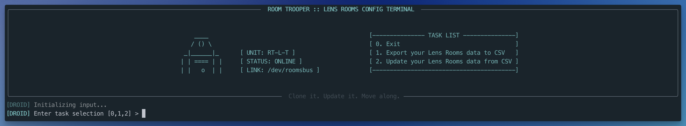

# 🔍 Lens Room Trooper

🤖 **Your droid companion for managing Lens Tenant room data**

The `room_trooper.py` script helps you manage room metadata within your Lens Tenant. It lets you query and update fields like `capacity`, `size`, and `floor`, essential for Lens Insights and Analytics. If your Tenant has rooms without this data, this tool helps you efficiently update them.

Installation and usage are fairly straightforward-**don't be intimidated by the length and detail in this README!** It's intentionally verbose to accomodate a wide range of experience levels.

---

## 🚀 Features

- Authenticates using OAuth2 Client Credentials
- Exports all rooms from your Lens tenant to the `room_data.csv` file
- Reads room data from `room_data.csv` and udpates it in your Lens Tenant
- Colorized, styled CLI output readability, logging, and error reporting

---

## 🧰 CLI Options

Running the script provides the following options:



 0. `Exit the script`
 1. `Export your Lens Room Data to CSV` - Runs a `query` that returns all rooms from your Lens tenant and writes them to a `room_data.csv`.
    - `roomName` and `siteName` are returned alongside their `Ids` and written to `room_data.csv`. This makes it easier for you to identify the room and provide `capacity`, `size`, and `floor` values for import.
 2. `Update your Lens Room Data from CSV` - Reads the rooms data from `room_data.csv` and runs a `mutation` to update them in Lens.
    - For each room imported, the `roomId`, `tenantId` and `siteId` are **required**. The `roomName` and `siteName` aren't used, even if they're in the `.csv`.

   > Options 1 and 2 utilize the `room_data.csv` file in the project root directory.

If you already have the `tenantId`, `siteId`, `roomId`, feel free to edit the `room_data.csv` file with the information found in [CSV Format](./README.md#-csv-format).

---

## 📁 Project Structure

```
lens-api-python/
├── room_trooper.py                # Main file containing CLI script you'll use
├── requirements.txt               # Python dependencies
├── room_data.csv                  # CSV used for import and export
├── .env.example                   # Example environment variable file
├── .gitignore                     # Files and folders git ignores
├── update_room_data.py            # Query and mutation logic
├── env_helper_util.py             # Helper functions
└── README.md                      # Project docs
```

---

## 📦 Requirements

### Python 3.8+

If you don't already have Python 3.8+ installed on your system, you'll need to install it first. Visit [python.org]("https://www.python.org/downloads/") for the latest installers.

  > When manually installing Python 3.8+, make sure to **add Python to your system's PATH** during installation

  - **On Windows:** the Python installer provides the option **"Add Python to PATH"** -- be sure to check the box during setup

  - **On MacOS:** the Python installer usually handles PATH setup. You might need to add Python to your shell profile manually if using a package manager like **Homebrew**

After installing Python 3.8+, confirm it's installed by running `python --version` (or `python3 --version` on macOS/Linux)

### Dependencies found in `requirements.txt`

To save you time and reduce complexity, the project inlcudes a `requirements.txt` file which contains the required dependencies.

## ⚙️ Setup Steps

Follow these setup steps (in order) prior to using the `room_trooper.py` script:

### 1️⃣ Clone the Repo

This project uses Git for version control. If you don't already have Git installed, you'll need to install it before cloning the repository.

- For **macOS**, you can install Git using Homebrew: `brew install git`
- For **Windows**, download and install Git from [git-scm.com]("https://git-scm.com/downloads")

After installing Git, confirm it's installed by running: `git --version`
```bash
git clone https://github.com/dfreshreed/lens-api-python.git
cd lens-api-python
```

### 2️⃣ Setup Virtual Environment

This is important to prevent dependency conflicts and avoid potentially distrupting your global Python install.

#### **On Mac/Linux**:

```bash
python3 -m venv venv # unless you've aliased python=python3 in your shell config
source venv/bin/activate
```

#### **On Windows - Command Prompt (cmd.exe)**:

```bat
python -m venv venv
venv\Scripts\activate.bat
```

#### **On Windows - Powershell (pwsh)**:

```powershell
python -m venv venv
venv\Scripts\Activate.ps1
```

> **Note for Powershell Users:**
> If you see an error about script execution policies, run this command first:
> ```powershell
> Set-ExecutionPolicy -Scope Process -ExecutionPolicy Bypass
> ```

### 3️⃣ Install Dependencies

Run this command to install the required dependencies:

```bash
pip install -r requirements.txt
```

### 4️⃣ Set Environment Variables

Copy `.env.example` to create a local `.env`

```bash
cp .env.example .env
```

Replace the placeholder text with your API Credentials, Tenant ID, and Site ID `.env`:

```bash
CLIENT_ID=your-client-id
CLIENT_SECRET=your-client-secret
TENANT_ID=your-tenant-id
SITE_ID=your-site-id # only required if you're batching this process by site
```

### 5️⃣ CSV Format

If you don't use the script to `export` your rooms, rename **your** `.csv` to `room_data.csv` (the script expects this filename), verify it contains the required headers (listed below), and replace the project `room_data.csv` file with yours.

> If you are batching room updates by site (instead of all rooms in the tenant), you can add the `siteId` to the `.env` and exclude it from the `.csv` header.

```
id,capacity,size,floor,siteId
```

Expected types and data format:

| Column     | Type    | Description                                                |
| ---------- | ------- | ---------------------------------------------------------- |
| `id`       | String  | The unique Lens-generated room ID                          |
| `capacity` | Integer | Maximum number of people the room can accommodate          |
| `size`     | Enum    | One of: NONE, FOCUS, HUDDLE, SMALL, MEDIUM, LARGE          |
| `floor`    | String  | Name of the floor the room is on (e.g. "1", "2nd", "Main") |
| `siteId`    | String  | The Site ID associated with the Room (optional if in .env) |

---

## 🧠 Usage

Before running the script, remember to activate the virtual environment:


```bash
source venv/bin/activate  # Mac/Linux
venv\Scripts\activate.bat # Windows cmd
venv\Scripts\Activate.ps1 # Windows PowerShell
```

If your virtual environment (venv) is activated, you'll see a `(venv)` prefix in your terminal, like this:

```bash
(venv) ➜  lens-api-python $
```

Then you can run the script:

```bash
python3 room_trooper.py #Mac/Linux
python room_trooper.py # Windows
```

---
## 🖥️ Windows-Specific Notes

- Use `python` instead of `python3`
- Activate the virtual environment with the correct script for your shell:
    - cmd → `activate.bat`
    - PowerShell → `Activate.ps1`
- Save CSV files as **UTF-8** format in Excel:
`CSV UTF-8 (Comma delimited) (*.csv)`
- If you see weird line breaks, run this to fix Windows line endings:

    ```bash
    git config core.autocrlf true
    ```
  > 💡 Works in `cmd`, `PowerShell`, or `Git Bash`
---

## 🧪 Example Output

The CLI will output styled responses, showing GraphQL success/error details:

Export:

```css
[DROID] RT-L-T fully operational.
[DROID] Exported 4 rooms to room_data.csv.
```

Import:

```css
2025-05-24 23:52:56 | [INFO] | Row 0 updated:
{
  "data": {
    "upsertRoom": {
      "name": "Daniel Reed Desk",
      "id": "03b9975c-5b2a-4007-9ef1-034ec756d3b4",
      "capacity": 1,
      "size": "SMALL",
      "updatedAt": "2025-05-25T03:52:56.794Z",
      "floor": "1"
    }
  }
}

2025-05-24 23:52:56 | [INFO] | 🏁 update_rooms() completed successfully with no errors.

```

## 🛡️ Security

Never commit your `.env` file. It's already been added to the `.gitignore` for safety.
