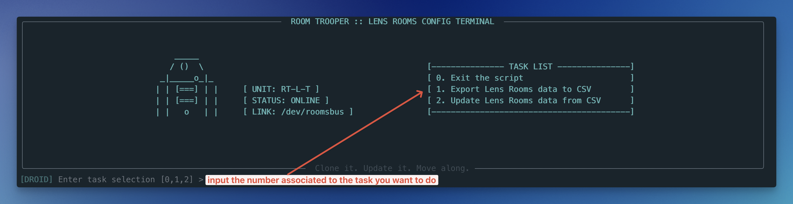
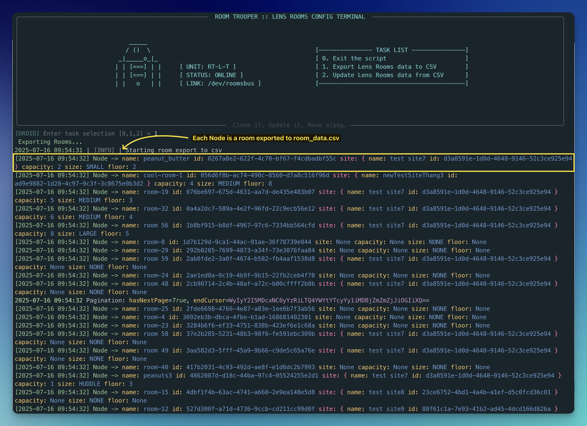
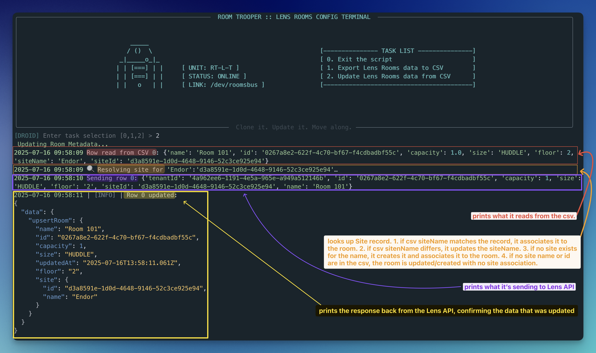

# 🤖 Lens Room Trooper

**Your droid CLI companion for exporting, importing, creating, and renaming Lens Tenant rooms** → *Clone it. Update it. Move along.*

  <p align="center">
    
  </p>

---

## 🚀 Features

- Authenticates using OAuth2 Client Credentials
- **Exports all rooms** from your Lens tenant to `room_data.csv`
- **Reads room data** from `room_data.csv` and updates it in your Lens Tenant
- **Create new rooms** when you leave the `id` column blank
- **Rename rooms** by changing the `name` value
- **Auto‑resolves sites** by `siteId` or `siteName` → on‑the‑fly creation of new Sites
- **Rename Sites** Provide a new `siteName` for an existing `siteId` and we'll rename it (siteId doesn't change)
- **Smart caching** of site lookups/renames → only one HTTP call per unique ID or name per run
- **Per‑row error handling** → logs GraphQL or network failures and keeps going, then summarizes bad rows
- Colorized, styled CLI output with Pygments, rich logging, and error reporting

---

## 🧰 CLI Options

  <p align="center">
    
  </p>

Running the script provides three options:

 #### 0. `Exit the script`

 #### 1. `Export Lens Rooms Data to CSV`

  <p align="center">
    
  </p>

    - Runs a `query` that returns all rooms from your Lens tenant and writes them to `room_data.csv`
    - Returns both room `name` and `siteName` alongside their `Ids` so you can easily identify end edit the rows

 #### 2. `Update Lens Rooms Data from CSV`

   <p align="center">
    
  </p>

    - Reads the room data from `room_data.csv` and runs a `mutation` to update:
      - Update existing rooms' metadata (`capacity`, `size`, `floor`)
      - Renames rooms when you change the `name` field
      - Creates **new** rooms for rows where `id` is blank (uses `name` you provide)
    - Auto-resolves Sites: looks up by `siteName` or `siteId`, creates if missing, renames existing
      - If a row's `siteId` and `siteName` are blank, it will update/create the room without a site association

   > Options 1 and 2 both read from `room_data.csv` in the project root

---

## 📁 Project Structure

```
lens-api-python/
├── room_trooper.py                # Main file containing CLI script you'll use
├── update_room_data.py            # Core GraphQL query and mutation logic
├── requirements.txt               # Python dependencies
├── room_data.csv                  # CSV used for import/export
├── .env.example                   # Example environment variable file
├── .gitignore                     # Files and folders Git ignores
├── utils/
│   ├── ascii.py                   # CLI ASCII art
│   ├── auth.py                    # OAuth token retrieval and caching
│   ├── env_helper.py              # Environment loading, config, and logging
│   ├── obi_site_kenobi.py         # Site helper logic (lookup, create, rename)
│   └── panel_renderer.py          # CLI rendering components
└── README.md                      # Project docs
```

---

## 📦 Requirements

### Python 3.8+

If you don't already have Python 3.8+ installed on your system, you'll need to install it first. Visit [python.org](https://www.python.org/downloads/) for the latest installers.

  > When manually installing Python 3.8+, make sure to **add Python to your system's PATH** during installation

  - **On Windows:** the Python installer provides the option **"Add Python to PATH"** -- be sure to check the box during setup

  - **On MacOS:** the Python installer usually handles PATH setup. You might need to add Python to your shell profile manually if using a package manager like **Homebrew**

After installing Python 3.8+, confirm it's installed by running `python --version` (or `python3 --version` on macOS/Linux)

### Dependencies found in `requirements.txt`

To save you time and reduce complexity, the project inlcudes a `requirements.txt` file which contains the required dependencies.

## ⚙️ Setup Steps

Follow these setup steps (in order) prior to using the `room_trooper.py` script:

### 1️⃣ Clone the Repo

This project uses Git for version control. If you don't already have Git installed, you'll need to install it before cloning the repository.

- For **macOS**, you can install Git using Homebrew: `brew install git`
- For **Windows**, download and install Git from [git-scm.com](https://git-scm.com/downloads)

After installing Git, confirm it's installed by running: `git --version`
```bash
git clone https://github.com/dfreshreed/lens-room-trooper.git
cd lens-api-python
```

### 2️⃣ Setup Virtual Environment

This is important to prevent dependency conflicts and avoid potentially distrupting your global Python install.

#### **On Mac/Linux**:

```bash
python3 -m venv venv # unless you've aliased python=python3 in your shell config
source venv/bin/activate
```

#### **On Windows - Command Prompt (cmd.exe)**:

```bat
python -m venv venv
venv\Scripts\activate.bat
```

#### **On Windows - Powershell (pwsh)**:

```powershell
python -m venv venv
venv\Scripts\Activate.ps1
```

> **Note for Powershell Users:**
> If you see an error about script execution policies, run this command first:
> ```powershell
> Set-ExecutionPolicy -Scope Process -ExecutionPolicy Bypass
> ```

### 3️⃣ Install Dependencies

Run this command to install the required dependencies:

```bash
pip install -r requirements.txt
```

### 4️⃣ Set Environment Variables

Copy `.env.example` to create a local `.env`

```bash
cp .env.example .env # Mac/Linux
copy .env.example .env # Windows cmd
Copy-Item .env.example .env # Windows PowerShell

```

Replace the placeholder text with your API Credentials, Tenant ID, and Site ID `.env`:

```bash
LENS_EP=https://api.silica-prod01.io.lens.poly.com/graphql
AUTH_URL=https://login.lens.poly.com/oauth/token

CLIENT_ID=your-client-id
CLIENT_SECRET=your-client-secret
TENANT_ID=your-tenant-id
SITE_ID=your-site-id # use this if you want to update rooms by site. otherwise, you can remove it.
```

### 5️⃣ CSV Format

If you want to use the script to update your rooms using your own `.csv`, ensure the following:
- rename **your** `.csv` to `room_data.csv` (the script expects this filename)
- verify it contains the required headers
  - `name,id,capacity,size,floor,siteName,siteId`
- remove the project's `room_data.csv` and replace it with yours.


Expected types and data format:

| Column     | Type    | Description                                                |
| ---------- | ------- | ---------------------------------------------------------- |
| `name`     | String  | The name of the room. Used for new-room creation or renaming an existing room. Room names must be unique                          |
| `id`       | String  | (Optional) Lens-generated room `ID`. Leave blank to create a new room                          |
| `capacity` | Integer | Maximum number of people the room can accommodate          |
| `size`     | Enum    | One of: `NONE`, `FOCUS`, `HUDDLE`, `SMALL`, `MEDIUM`, `LARGE`        |
| `floor`    | String  | Name of the floor the room is on (e.g. "1", "2nd", "Main") |
| `siteName`    | String  | (Optional) Name of the site. Used to lookup/create/rename sites when `siteId` is blank or unchanged. <br/> If empty **and** `siteId` is empty → **new rooms** are created without site association and **existing rooms** are un-associated from their existing site <br/> |
| `siteId`    | String  | (Optional) Existing site ID. If provided with a different `siteName`, the site will be renamed. <br/> If empty **and** `siteName` is empty → **new rooms** are created without site association and **existing rooms** are un-associated from their existing site <br/> |


> By default, the script returns all rooms in your Lens Tenant. If you prefer to batch the process by Site, you can add the `siteId` to the `.env` and exclude it from the `.csv` header.

---

## 🧠 Usage

Before running the script, remember to activate the virtual environment:

```bash
source venv/bin/activate  # Mac/Linux
venv\Scripts\activate.bat # Windows cmd
venv\Scripts\Activate.ps1 # Windows PowerShell
```

If your virtual environment (venv) is activated, you'll see a `(venv)` prefix in your terminal, like this:

```bash
(venv) ➜  lens-api-python $
```

Then you can run the script:

```bash
python3 room_trooper.py # Mac/Linux
python room_trooper.py # Windows
```

---

## 🖥️ Windows-Specific Notes

- Use `python` instead of `python3`
- Activate the virtual environment with the correct script for your shell:
    - cmd → `activate.bat`
    - PowerShell → `Activate.ps1`
- Save CSV files as **UTF-8** format in Excel:
`CSV UTF-8 (Comma delimited) (*.csv)`
- If you see weird line breaks, run this to fix Windows line endings:

    ```bash
    git config core.autocrlf true
    ```
  > 💡 Works in `cmd`, `PowerShell`, or `Git Bash`
