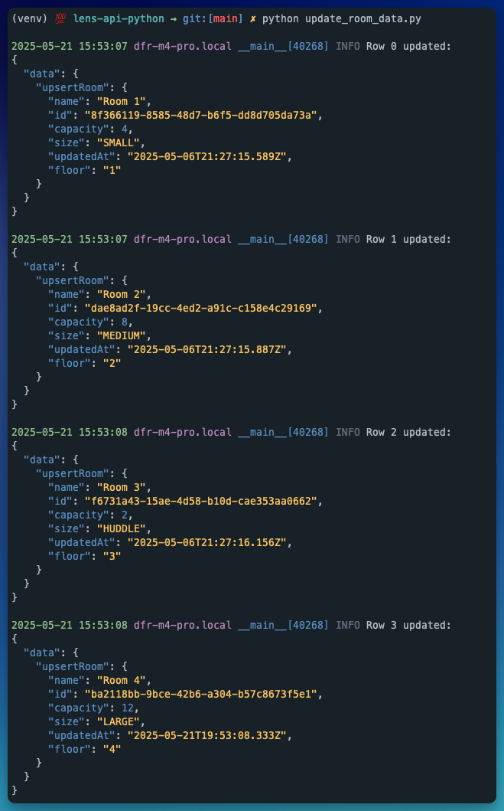

# 🔍 Lens API Python

This Python script is designed to help you update the metadata fields for rooms in your Lens Tenant.

The script launches a CLI tool that provides you the option to query all rooms or update rooms. Both options utilize the `room_data.csv` file found in the root directory.

The `upsertRoom` mutation requires `tenantId` and `siteId` arguments. It also utilizes the `roomId` (not room name) to update the metadata. If you haven't already pulled these details down, you'll want to start with option 1️⃣ `Export your Lens Room data to CSV`

If you already have the `tenantId`, `siteId`, `roomId`, feel free to edit the `room_data.csv` file with the information.

---

## 🚀 Features

- Authenticates using OAuth2 client credentials
- Exports all rooms from your Lens tenant and writes the data to `room_data.csv`
- Reads room data from `room_data.csv` and sends the `upsertRoom` mutation
- Colorized output for logging and error reporting

---

## 📁 Project Structure

```
lens-api-python/
├── room_tool.py  # Main script
├── requirements.txt     # Python dependencies
├── room_data.csv        # Sample input file
├── .env.example         # Example environment variable file
├── .gitignore           # Files and folders to ignore in git
└── README.md            # Project documentation
```

---

## 📦 Requirements

- Python 3.8+
- `requests`, `pandas`, `python-dotenv`, `coloredlogs`, `pygments`, `rich`

### ⚙️ Setup Steps

To use the script, follow these setup steps (in order):

#### Clone the repo

```bash
git clone https://github.com/dfreshreed/lens-api-python.git
cd lens-api-python
```

#### Setup virtual environment

This is important to prevent dependency conflicts and avoid distrupting your global Python install.

```bash
python3 -m venv venv
source venv/bin/activate
```

#### Install dependencies

```bash
pip install -r requirements.txt
```

#### Set environment variables

Copy `.env.example` to create a local `.env`

```bash
cp .env.example .env
```

Replace the placeholder text with your API Credentials, Tenant ID, and Site ID `.env`:

```bash
CLIENT_ID=your-client-id
CLIENT_SECRET=your-client-secret
TENANT_ID=your-tenant-id
SITE_ID=your-site-id #only required if you're batching this process by site
```

#### 📂 CSV Format

Your `room_data.csv` should contain the following headers:

```
id,capacity,size,floor, siteId
```

The `room_data.csv` included in this repo contains four rows of example data; each row represents one room to update. You don't have to edit or use this `.csv`.

However, if you're replacing the file included in this project, make sure your columns match the expected format and rename it to `room_data.csv` (the script expects that file name).

Expected types and data format:

| Column     | Type    | Description                                                |
| ---------- | ------- | ---------------------------------------------------------- |
| `id`       | String  | The unique Lens-generated room ID                          |
| `capacity` | Integer | Maximum number of people the room can accommodate          |
| `size`     | Enum    | One of: NONE, FOCUS, HUDDLE, SMALL, MEDIUM, LARGE          |
| `floor`    | String  | Name of the floor the room is on (e.g. "1", "2nd", "Main") |

---

## 🧠 Usage

After you've added your `.env` variables and updated the `room_data.csv` file, run:

```bash
source venv/bin/activate
python update_room_data.py
```

---

## 🧪 Example Output

When running the script, the response (from each mutation sent) will print to the CLI.

> **Note:** The image below shows the successful responses for the (four) rows in the example `room_data.csv`. If you try running this script using the example `room_data.csv` as is, you will get errors as you don't have access to these room Ids.



## 🛡️ Security

Never commit your `.env` file. It's already been added to the .gitignore for safety.
