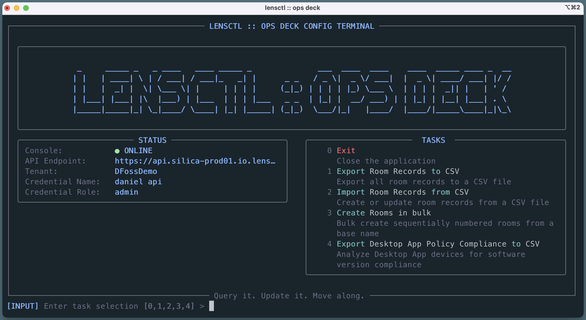
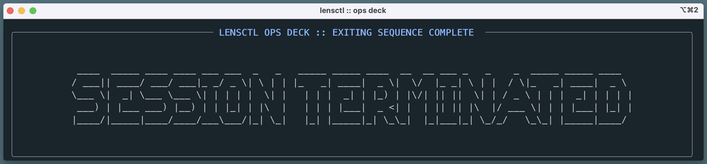
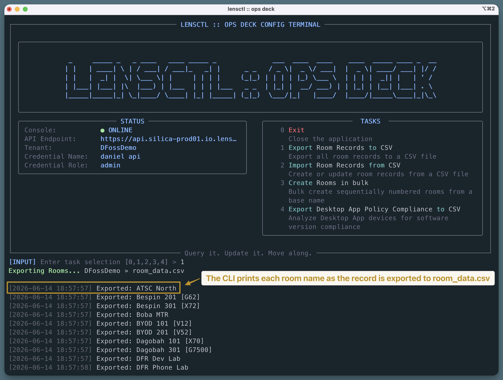
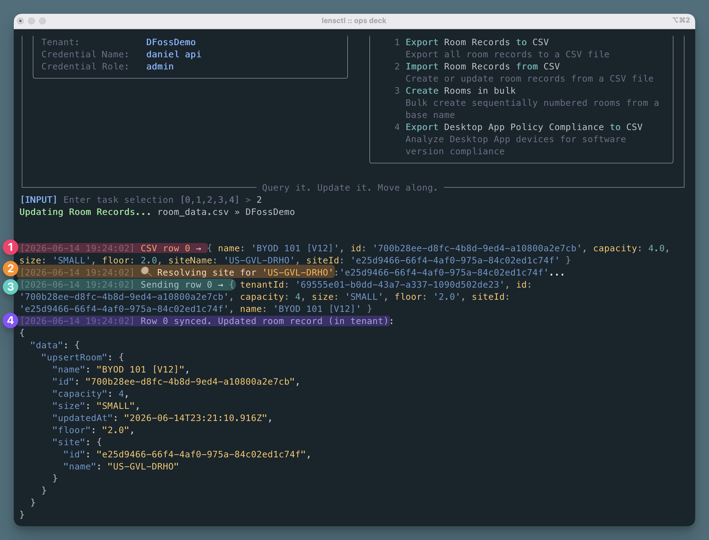
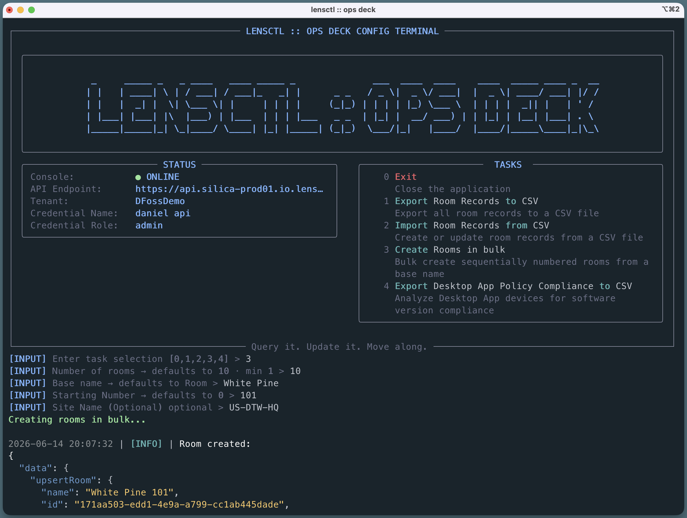
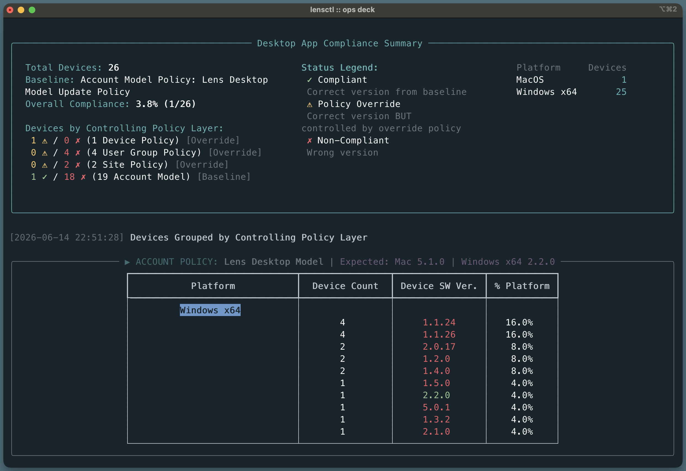

# 🤖 `lensctl` Ops Deck

**A CLI tool built for day-to-day Poly Lens tenant ops** → _Query it. Update it. Move along._

#### Want to see it in action? 👇🏼

[](https://youtu.be/Hg4FEKGaGtM)

---

## 🚀 Features

### Room Management

- Authenticates using OAuth2 Client Credentials
- **Export and import rooms** via `room_data.csv` » create, update, and rename in bulk
- **Bulk create rooms** from the CLI (no CSV) with sequential names (e.g., Redwood 101, Redwood 102)
- **Room & site operations from a single CSV row** » assign, create, rename, or re-assign sites without separate steps
- **Per‑row error handling** that logs failures and keeps going, summarizes at the end
- Colorized, styled CLI output with timestamped logging

### Policy Compliance (Desktop App)

- **Policy-based compliance** measures compliance against the version you've specified in policy, not the latest available version.
- **Handles large tenants** through concurrent processing for device counts exceeding 10,000
- **Visibility** into which policy layer is winning and why
- **CLI summary & CSV exports** providing an aggregated report and full per-device detail

---

## 🧰 Using the CLI

  <p align="center">
    
  </p>

### 0. `Exit the script`

  <p align="center">
    
  </p>

### 1. `Export Room Data to CSV`

  <p align="center">
    
  </p>

- Runs a `query` that returns all rooms from your Lens tenant and writes them to `room_data.csv`
- Returns both room `name` and `siteName` alongside their `IDs` so you can easily identify and edit the rows

### 2. `Update Room Data from CSV`

   <p align="center">
    
  </p>

1. Reads the room data from `room_data.csv`
2. Auto-resolves Sites: looks up by `siteName` or `siteId`, creates if missing, renames existing
   - `siteId` + matching `siteName` → no change
   - `siteId` + different `siteName` that exists in Lens → room moves to that site
   - `siteId` + different `siteName` that doesn't exist → site is renamed (affects all rooms at that site)
   - `siteName` only (no `siteId`) → looks up site by name; creates it if not found
   - Both blank → room is saved without a site association
3. After resolving site, prints the room record update sent to Lens API
4. Response back from API. Updated room record that's in the tenant.

#### CSV Column Reference:

If you want to use the script to update your rooms using your own `.csv`, ensure the following:

- rename **your** `.csv` to `room_data.csv` (the script expects this filename)
- verify it contains the required headers
  - `name,id,capacity,size,floor,siteName,siteId`
- remove the project's `room_data.csv` and replace it with yours.

Expected types and data format:

| Column     | Type    | Description                                                                                                                                                                                                                                                                                                                                                                |
| ---------- | ------- | -------------------------------------------------------------------------------------------------------------------------------------------------------------------------------------------------------------------------------------------------------------------------------------------------------------------------------------------------------------------------- |
| `name`     | String  | The name of the room. Used for new-room creation or renaming an existing room. Room names must be unique                                                                                                                                                                                                                                                                   |
| `id`       | String  | (Optional) Lens-generated room `ID`. Leave blank to create a new room                                                                                                                                                                                                                                                                                                      |
| `capacity` | Integer | Maximum number of people the room can accommodate                                                                                                                                                                                                                                                                                                                          |
| `size`     | Enum    | One of: `NONE`, `FOCUS`, `HUDDLE`, `SMALL`, `MEDIUM`, `LARGE`                                                                                                                                                                                                                                                                                                              |
| `floor`    | String  | Name of the floor the room is on (e.g. "1", "2nd", "Main")                                                                                                                                                                                                                                                                                                                 |
| `siteName` | String  | (Optional) Name of the site to associate with this room: <br/> - **No `siteId` present** » looks up the site by name; creates site if not found <br/> - **`siteId` present and `siteName` matches** » no change <br/> - **`siteId` present and `siteName` differs** » see `siteId` behavior below <br/> - **`siteId` and `siteName` blank** » room has no site association |
| `siteId`   | String  | (Optional) Lens generated site ID. <br/> - **`siteName` matches** » no change <br/> - **`siteName` differs and already exists in Lens** » room moves to that existing site <br/> - **`siteName` differs and doesn't exist in Lens** » existing site gets renamed <br/> - **both columns blank** » room has no site association                                             |

> **Moving rooms to a new site:** Clear both `siteId` and `siteName`, then add the new `siteName` to each room. The tool creates the site, caches the new `siteId`, and uses it for each row using the new site name; no duplicates created.

**Note:** By default, the script returns all rooms in your Lens Tenant. If you prefer to batch the process by Site, you can add the `siteId` to the `.env` and exclude it from the `.csv` header.

### 3. `Create Rooms (bulk)`

   <p align="center">
    
  </p>

Quickly scaffold room (and site) names. Create rooms in bulk, then use the CSV import to tweak metadata.

- Interactive prompts:
  - **How many rooms** → The count of rooms to create. Defaults to 10, minimum of 1
  - **Starting number** → The first number in the sequence (e.g., `101`)
  - **Base Name** → The text prefix for the room (e.g., `Redwood`)
  - **Site name (optional)** → Associates rooms to the site. Uses the `siteName` to lookup the `siteId`. If no `siteId` is found, creates the site.

**Naming rule:** the tool automatically inserts a space between the base name and number (e.g., `Redwood 101`, `Redwood 201`, etc.)

**Defaults used for new rooms:** `capacity=None`, `size="NONE"`, `floor=""`. Use CSV import to update these fields

> Options 1 and 2 both use `room_data.csv` in the project root

### 4. `Export Desktop App Policy Compliance`

Analyze Desktop App compliance by the version you've defined in Lens policy.

**What it does:**

1. Fetches all Desktop App devices from your tenant
2. Retrieves the policy stack for each device
3. Prompts you to select a compliance baseline:
   - **Account (Model)**: tenant-wide model policy (lowest priority, broadest scope)
   - **Site**: a specific site policy
   - **Group**: a specific user group policy
4. For Site/Group baselines: shows a preview of how many devices are in scope before proceeding
5. Displays a CLI summary: overall compliance %, devices aggregated by which policy is controlling them, grouped by platform and software version
6. Exports per device results to a CSV: `desktop-app-compliance-full.csv`
7. Exports the compliance summary to a CSV: `desktop-app-compliance-summary.csv`

**Compliance Status:**

Each device is evaluated against the baseline (you've chosen) and assigned one of three statuses:

| Status            | Meaning                                                                                                 |
| ----------------- | ------------------------------------------------------------------------------------------------------- |
| ✓ Compliant       | Running the **expected version** and **controlled by the baseline policy**                              |
| ⚠ Policy Override | Running the **expected version** but is **controlled by an override policy** (device/device group/site) |
| ✗ Non-Compliant   | Not running the **expected version**                                                                    |

**Use Cases:**

- **Validate site rollouts**: Confirm all devices in a site are running the expected version
- **Audit group policies**: Check if specific user groups are compliant with their policy targets
- **Tenant-wide compliance**: Measure how many devices match the account-level baseline
- **Troubleshoot policy conflicts**: Identify which policy is actually controlling each device

**Account Model Compliance Summary Example:**

   <p align="center">
    
  </p>

---

## 📁 Project Structure

```
lensctl-ops-deck/
├── cli.py                         # Main CLI script
├── requirements.txt               # Python dependencies
├── room_data.csv                  # CSV used for room import/export
├── .env.example                   # Example environment variable file
├── .gitignore                     # Files and folders Git ignores
├── utils/
│   ├── ascii.py                   # CLI ASCII art
│   ├── auth.py                    # OAuth token retrieval and caching with session pooling
│   ├── bulk_create.py             # Bulk room creation logic
│   ├── compliance_analysis.py     # Policy data processing and parsing
│   ├── compliance_ops.py          # Policy compliance analysis and reporting
│   ├── device_ops.py              # Device fetching and policy stack retrieval
│   ├── env_helper.py              # Environment loading, config, and logging
│   ├── input_helpers.py           # User input validation helpers
│   ├── panel_renderer.py          # CLI rendering components
│   ├── policy_ops.py              # Policy management helpers (future use)
│   ├── room_ops.py                # Core GraphQL query and mutation logic
│   └── site_ops.py                # Site helper logic (lookup, create, rename)
└── README.md                      # Project documentation
```

---

## 📦 Requirements

### Python 3.10+

If you don't already have Python 3.10+ installed on your system, you'll need to install it first. Visit [python.org](https://www.python.org/downloads/) for the latest installers.

> When manually installing Python 3.10+, make sure to **add Python to your system's PATH** during installation

- **On Windows:** the Python installer provides the option **"Add Python to PATH"** -- be sure to check the box during setup

- **On MacOS:** the Python installer usually handles PATH setup. You might need to add Python to your shell profile manually if using a package manager like **Homebrew**

After installing Python 3.10+, confirm it's installed by running `python --version` (or `python3 --version` on macOS/Linux)

### Dependencies found in `requirements.txt`

To save you time and reduce complexity, the project includes a `requirements.txt` file which contains the required dependencies.

## ⚙️ Setup Steps

Follow these setup steps (in order) prior to using the `cli.py` script:

### 1️⃣ Clone the Repo

This project uses Git for version control. If you don't already have Git installed, you'll need to install it before cloning the repository.

- For **macOS**, you can install Git using Homebrew: `brew install git`
- For **Windows**, download and install Git from [git-scm.com](https://git-scm.com/downloads)

After installing Git, confirm it's installed by running: `git --version`

Then, clone the repo:

```bash
git clone https://github.com/dfreshreed/lensctl-ops-deck.git
cd lensctl-ops-deck
```

### 2️⃣ Setup Virtual Environment

This is important to prevent dependency conflicts and avoid potentially disrupting your global Python install.

#### **On Mac/Linux:**

```bash
python3 -m venv .venv --upgrade-deps
source .venv/bin/activate
```

#### **On Windows - Command Prompt (cmd.exe):**

```bat
python -m venv .venv --upgrade-deps
.\.venv\Scripts\activate.bat
```

#### **On Windows - Powershell (pwsh):**

```powershell
python -m venv .venv --upgrade-deps
.\.venv\Scripts\Activate.ps1

# If you get an execution policy error, run this command:
# Set-ExecutionPolicy -Scope Process -ExecutionPolicy Bypass
```

> **If you see `error: externally-managed-environment`**
> You used the system `pip`. Make sure the venv is active and re-run installs with `python -m pip install -r requirements.txt`
> Check with `python -m pip --version` - the path should point **inside** the `.venv`

### 3️⃣ Install Dependencies

With your `.venv` activated, run this command to install the required dependencies:

```bash
python -m pip install -r requirements.txt
```

### 4️⃣ Set Environment Variables

Copy `.env.example` to create a local `.env`

```bash
cp .env.example .env # Mac/Linux
copy .env.example .env # Windows cmd
Copy-Item .env.example .env # Windows PowerShell

```

Replace the placeholder text with your API Credentials, Tenant ID, and Site ID `.env`:

```bash
LENS_EP=https://api.silica-prod01.io.lens.poly.com/graphql
AUTH_URL=https://login.lens.poly.com/oauth/token

CLIENT_ID=your-client-id
CLIENT_SECRET=your-client-secret
TENANT_ID=your-tenant-id
SITE_ID=your-site-id # use this if you want to update rooms by site. otherwise, you can remove it.
```

---

## 🧠 Usage

Before running the script, or if you've closed/reloaded the terminal session, remember to activate the virtual environment:

```bash
source .venv/bin/activate  # Mac/Linux
.venv\Scripts\activate.bat # Windows cmd
.venv\Scripts\Activate.ps1 # Windows PowerShell
```

If your virtual environment (venv) is activated, you'll see a `(venv)` prefix in your terminal, like this:

```bash
(venv) ➜  lensctl-ops-deck $
```

Then you can run the script:

```bash
python3 cli.py # Mac/Linux
python cli.py # Windows
```

---

## 🖥️ Windows-Specific Notes

- Use `python` instead of `python3`
- Activate the virtual environment with the correct script for your shell:
  - cmd → `activate.bat`
  - PowerShell → `Activate.ps1`
- Save CSV files as **UTF-8** format in Excel:
  `CSV UTF-8 (Comma delimited) (*.csv)`
- If you see weird line breaks, run this to fix Windows line endings:

  ```bash
  git config core.autocrlf true
  ```

  > 💡 Works in `cmd`, `PowerShell`, or `Git Bash`
